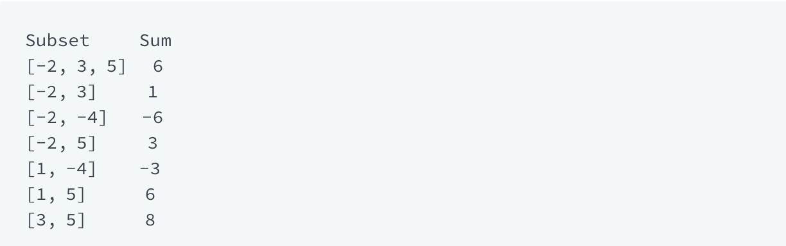

## Max Sub Array Sum
[Max Sub Array HackerRank Link](https://www.hackerrank.com/challenges/max-array-sum/problem?h_l=interview&playlist_slugs%5B%5D=interview-preparation-kit&playlist_slugs%5B%5D=dynamic-programming)
Given an array of integers, find the subset of non-adjacent elements 
with the maximum sum. Calculate the sum of that subset.

For example, given an array [-2, 1, 3, -4, 5] we have the following possible 
subsets:

Our maximum subset is 8.

## Function Description
Complete the  function in the editor below. It should return an integer representing the maximum subset sum for the given array.

maxSubsetSum has the following parameter(s):

- arr: an array of integers

### Input Format
- The first line contains an integer, n.
- The second line contains n space-separated integers arr[i].

### Constraints
- 1 <= n <= 10^5
- 10^4 <= arr[i] <= 10^4

### Output Format
Return the maximum sum described in the statement.