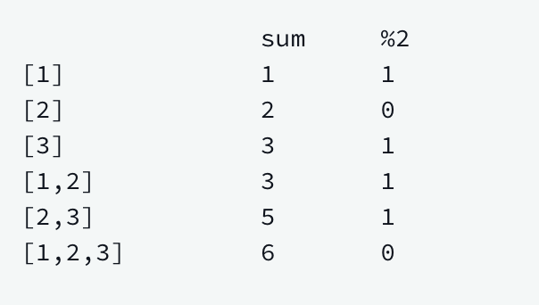

## Max Sub Array Sum

[Max SubArray Sum HackerRank Link](https://www.hackerrank.com/challenges/maximum-subarray-sum/problem)

We define the following:

- A sub array of array "a" of length "n" is a contiguous segment from 
a[i] through a[j] where 0 <= i <= j < n.

- The sum of an array is the sum of its elements.

Given an "n" element array of integers, "a", and an integer, "m", determine 
the maximum value of the sum of any of its sub arrays modulo "m". For example, 
Assume a = [1, 2, 3] and m = 2. The following table lists all sub arrays and 
their moduli:

The maximum modulus is 1.
###Function Description
Complete the maximumSum function in the editor below. It should return a long 
integer that represents the maximum value of sub array sum % m.

maximumSum has the following parameter(s):

- a: an array of long integers, the array to analyze
- m: a long integer, the modulo divisor

###Input Format
The first line contains an integer q, the number of queries to perform.

The next q pairs of lines are as follows:

- The first line contains two space-separated integers n and (long) m, the length 
of a and the modulo divisor.

- The second line contains n space-separated long integers a[i].

###Output Format
For each query, return the maximum value of sub array % m as a long integer.

###Caveats
I have not created an optimal solution to this problem :/ I'll get to it eventually!
Thanks for your patience :) 
