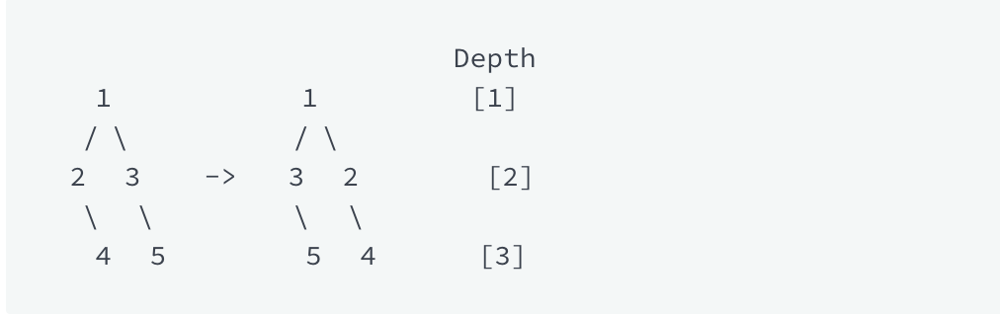

## Swap Nodes [Algo]

[Swap Nodes HackerRank Link](https://www.hackerrank.com/challenges/swap-nodes-algo/problem?h_l=interview&playlist_slugs%5B%5D=interview-preparation-kit&playlist_slugs%5B%5D=search)

###A Note About the File Structure...
Since this problem was mostly a test of architecture and abstraction (IMHO) I have forgone the dynamic test suite runner
in favor of more explicit, bespoke tests for the various components made to solve the problem. The solution is in the 
brute force file, with tests for each component in the tests folder. 

###Problem
A binary tree is a tree which is characterized by one of the following properties:

- It can be empty (null).
- It contains a root node only.
- It contains a root node with a left subtree, a right subtree, or both. These subtrees are also binary trees.

In-order traversal is performed as
1. Traverse the left subtree.
2. Visit root.
3. Traverse the right subtree.

For this in-order traversal, start from the left child of the root node and keep exploring the left subtree until you 
reach a leaf. When you reach a leaf, back up to its parent, check for a right child and visit it if there is one. 
If there is not a child, you've explored its left and right subtrees fully. If there is a right child, traverse its 
left subtree then its right in the same manner. Keep doing this until you have traversed the entire tree. 
You will only store the values of a node as you visit when one of the following is true:

- it is the first node visited, the first time visited
- it is a leaf, should only be visited once
- all of its subtrees have been explored, should only be visited once while this is true
- it is the root of the tree, the first time visited

Swapping: Swapping subtrees of a node means that if initially node has left subtree L and right subtree R, then after 
swapping, the left subtree will be R and the right subtree, L.

For example, in the following tree, we swap children of node 1.

In-order traversal of left tree is 2 4 1 3 5 and of right tree is 3 5 1 2 4.

Swap operation:

We define depth of a node as follows:

- The root node is at depth 1.
- If the depth of the parent node is d, then the depth of current node will be d+1.

Given a tree and an integer, k, in one operation, we need to swap the subtrees of all the nodes at each depth h, 
where h ∈ [k, 2k, 3k,...]. In other words, if h is a multiple of k, swap the left and right subtrees of that level.

You are given a tree of n nodes where nodes are indexed from [1..n] and it is rooted at 1. You have to perform t swap 
operations on it, and after each swap operation print the in-order traversal of the current state of the tree.
 
### Function Description

Complete the swapNodes function in the editor below. It should return a two-dimensional array where each element is an 
array of integers representing the node indices of an in-order traversal after a swap operation.

swapNodes has the following parameter(s):
- indexes: an array of integers representing index values of each , beginning with , the first element, as the root.
- queries: an array of integers, each representing a  value.

#####Input Format:
The first line contains n, number of nodes in the tree.

Each of the next n lines contains two integers, a b, where a is the index of left child, and b is the index of right 
child of ith node.

Note: -1 is used to represent a null node.

The next line contains an integer, t, the size of .
Each of the next t lines contains an integer , each being a value .

#####Output Format:
For each k, perform the swap operation and store the indices of your in-order traversal to your result array. 
After all swap operations have been performed, return your result array for printing.